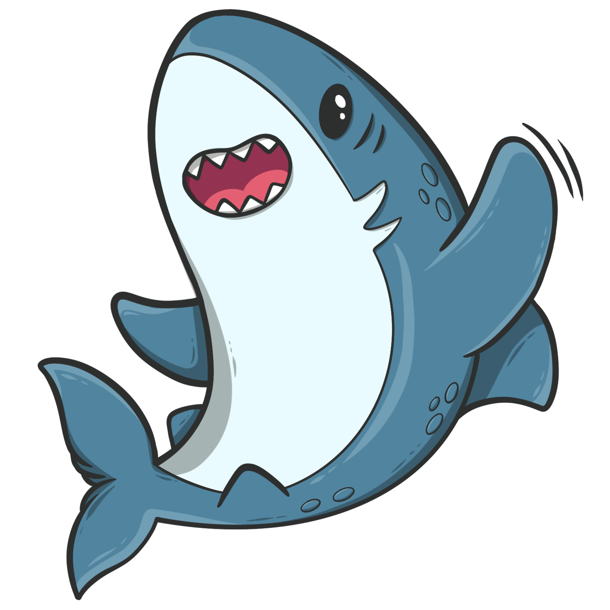

    

<h1>Hello, I'm Emma !</h1>
but you can call me Em's :)

 
    ✯  ✯  ✯  ✯  ✯  ✯  ✯  ✯  ✯  ✯  ✯  ✯ 

  
<h2> Who i am ?</h2>

  

  
it's sad but i'm just a girl who loves programming but not only that !

- I love my imagination, it's limitless and always waiting to find its limit.
- I love sea and marine animals.
- I love raccoons. I don't know why but i think the raccoon it's the cutest animal in the world.
- I love music, it's a big part of my life.

 

<h2> Programming...</h2>

I started programming in 2020.
 
I know :
   
        

  
 

  
More...

   

